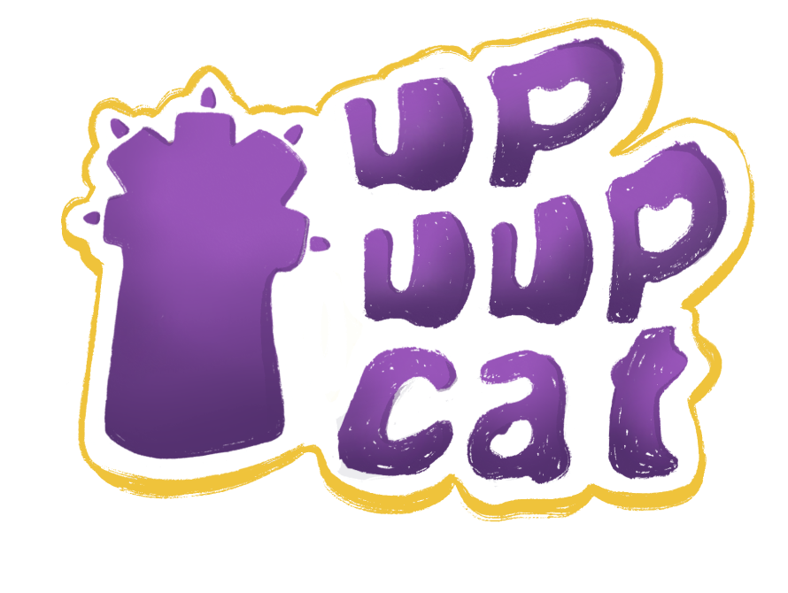

# Up Uup Cat 🐱🥒

Welcome to the official repository of "Up Uup Cat", a thrilling arcade game where agility and quick reflexes are your best tools for survival. Join our adventurous cat in a vertical sprint away from its quirky fear: cucumbers, while collecting delicious nigiris along the way!

## Features 🚀

- **Dynamic Gameplay**: Experience the thrill of dodging and leaping away from relentless cucumbers. Each jump requires precision and quick thinking to scale new heights.
- **Endless Challenges**: With procedurally generated walls and obstacles, no two climbs are the same. How high can you go?
- **Charming Graphics**: Dive into a visually stunning game world with adorable characters, vibrant environments, and smooth animations that keep you engaged for hours.
- **Catnip Boosts**: Discover catnip along your journey and use it to gain temporary boosts that help you climb faster and higher.
- **Jukebox**: Choose from a specially curated playlist to enhance your climbing spree.
- **Multi-Language Support**: Available in both English and Portuguese.

## Installation 📲

[Up Uup Cat on the App Store](https://apps.apple.com/us/app/up-uup-cat/id6479709715)

Download Up Uup Cat from the App Store to start your climbing adventure. Suitable for all ages and perfect for quick gaming sessions or extended plays.

## How to Play 🕹️

- **Tap and hold** to start aiming your jump.
- **Drag and release** to leap from one wall to another.
- **Avoid cucumbers** and collect nigiris for high scores.
- **Use catnip** for boosts and to escape tricky situations.

## Support 💖

Encountered a bug or have suggestions? Open an issue here on GitHub or contact us directly at [upuupcat@gmail.com](upuupcat@gmail.com).

## Contributing 🤝

Contributions to Up Uup Cat are always welcome! If you have an idea for a feature or a fix, please feel free to fork the repository, make your changes, and submit a pull request.

## License 📄

"Up Uup Cat" is licensed under the MIT License. See [LICENSE](LICENSE) for more information.

---

We hope you enjoy playing "Up Uup Cat" as much as we enjoyed creating it! 🌟
